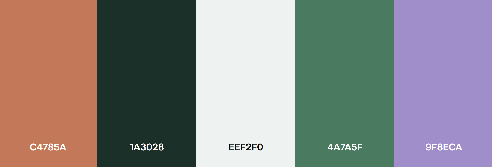
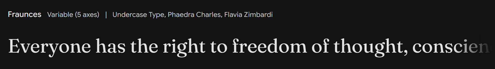
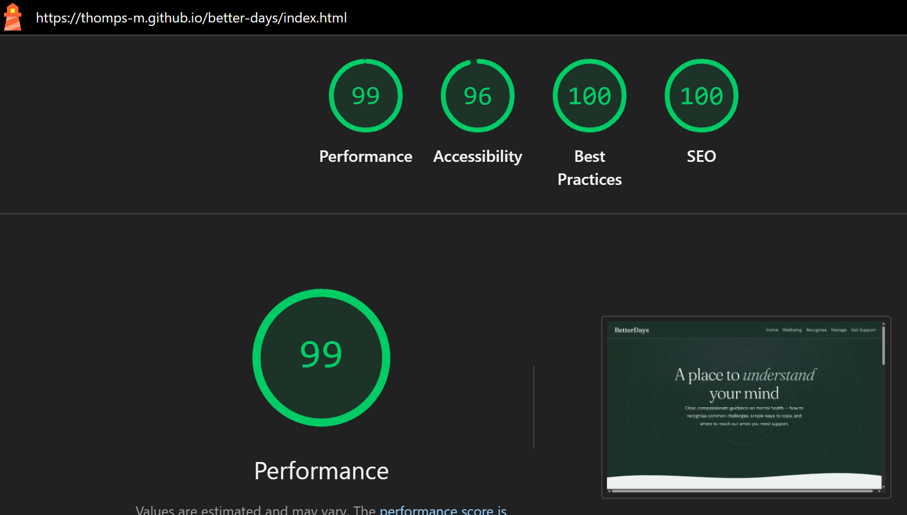
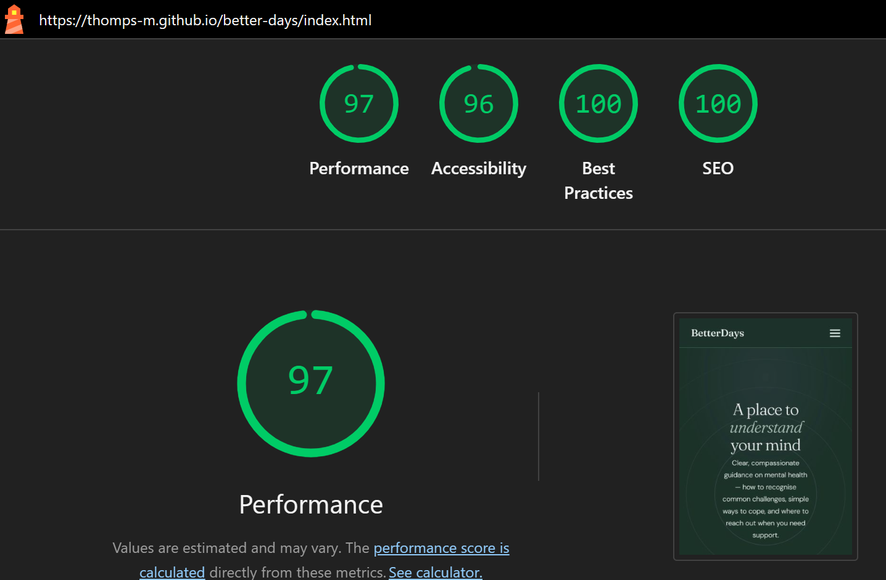

# BetterDays

## Overview
BetterDays is a single-page, front-end web application designed to give anyone — regardless of prior knowledge — a calm, accessible entry point into mental health. The MVP release has three main focuses - creating welcoming and calming site landing page; information regarding recognising common challenges; and UK-based sources of support for those who are struggling. In future, the site will expand to include more general information about mental wellbeing, as well as more practical advice on how to manage mental health challenges. 

The live site can be viewed [here](https://thomps-m.github.io/better-days/index.html).

## UX
### Defining Purpose and Functionality 
#### Business Requirements
#### User Needs

#### User Stories
As someone experiencing stress and low mood for the first time, I would like to be able to access clear mental health advice without feeling judged. 
- The page title, hero headline, and supporting description are visible without scrolling
- The headline clearly communicates that the site is about mental health guidance
- The tone of the copy is calm and non-clinical — it does not use alarming or stigmatising language
- A clear call-to-action button is present, directing the user to the main content
- The visual design does not feel corporate, medical, or overwhelming

As a mobile user, I would like to be able to access the site on my phone, and be able to easily find the information I need.
- All content is readable on screens 375px wide and above with no horizontal scrolling
- The navigation links remain accessible and do not overlap or clip on small viewports
- The condition cards stack into a single column on mobile
- Touch targets (tabs, labels, accordion summaries) are large enough to tap comfortably — minimum 44×44px
- Hero text scales fluidly using `clamp()` and does not overflow its container

As someone in acute distress, I would like to be able to find a helpline number as quickly as possible.

As someone with visual impairment, I would like to be able to read the text on the site.

As a loved one of someone who struggles with their mental health, I would like to better understand what my loved one is experiencing, and how I can help. 

As someone who prefers reduced-motion, I would like my preferences to be respected when I acess the site and its content. 

### Visualising Structure
#### Wireframes
Wireframes for the project, on mobile, tablet & desktop screen sizes. 

### Visual Elements
It was important that the visual design elements created a calm, welcoming and trustworthy feel to the site. Each of the design choices were made with these goals in mind.
#### Colour Palette

The core colour palette chosen for the project consists of the 3 central shades. These are: a soft mid-toned sage; a deep forest green; and a very pale, cool-toned grey. These shades were chosen for their tonal coherence and thematic relevance - creating a calming, natural feel. 

The CSS color-mix() function is used throughout the project to combine these 5 shades, in a variety of different ways. The reusability of these variables made for efficient colour use throughout the project, whilst ensuring tonal coherence. The range of these 3 core shades, therefore, was important - to allow for the mixing of both very light and very dark colours.

2 accent shades were used alongside the three core shades: a pop of lavender, and a warm peach. The lavender was chosen as the primary accent colour, to add visual interest against the greens. The colour was used primarily for visual details (more of which will be implemented in future). While these colours are complementary, the pairing is intentionally unexpected - to encourage a measured pace when browsing the site. However, the choice was not based solely on its interactions with the base colours; synonymous with the plant, which is widely used in health & wellness products, lavender has wellness and calming credentials all of its own.

The warm peach, used exclusively in the 'Get Support' section, was also used as an accent colour. Adding warmth in an otherwise cool-toned palette creates a sense off urgency, but the peachiness of the shade ensures it does not feel alarming.

An explorable version of the colour scheme is viewable [here](https://coolors.co/palette/C4785A-1A3028-EEF2F0-4A7A5F-9F8ECA).

#### Typography

The display font chosen for the project was Fraunces. The font was chosen for its warmth, and quirky feel. This creates a welcoming feel to the site, avoiding corporate coldness.

The body font chosen for the site was DM Sans, an open, rounded sans-serif font. A sense of openness, but reliability is created by this font. 

#### Shape & Space
Shape and space were used to further the goals of the site. Generous use of whitespace, so as never to have the user viewing too much content at one time, was key in ensuring a calm and measured feel to the site. 

Similarly, round shapes were used throughout for an open, welcoming feel. This is visible in the font choices, as well as the breathing rings - the signature of the hero section. 

The svg wave which forms the transition from the hero to the 'Recognise' section, too, engages with these ideas - using soft, lilting curves to draw the user to the next section. An organic, natural feel was important here - so the curve is intentionally asymmetric. 

Card shapes were also important in conveying the feel of the site. Different degrees of roundness were used depending on the required feel of the specific section - the Recognise section uses cards with only partly rounded corners, such that the welcoming sense is maintained, but a sense of authority & reliability is established. In contrast, in the 'Get Support' section, the corners are very rounded - creating a sense of approachability. 

This thematic use of shape will be continued in future features, with an animation-led guided breathing exercise. This will continue the use of the circle motif, this time to represent breath. 

## Features
Feature | Image | Explanation
--- | --- | ---
Navbar | | 
Hero | | 
Recognise | |
Common Challenges Cards | |
Get Support | | 
Footer | |

## Technologies & Tools
HTML
CSS
Bootstrap 5 

### Design Tools
- Figma (to create wireframes)
- Adobe Express (to edit design assets)
- Procreate (to create design assets)

### AI Use
#### Written Contributions
- Claude Chat was used to generate the base copy for the site, which was then copyedited by the developer. 
- Claude Chat was used to generate user stories for the site, which were then edited and expanded upon by the developer.

#### Design Contributions
- Chat GPT was used to generate design ideas for the favicon. One of these was selected as a suitable basis for the favicon design, which was then created by the developer using Adobe Express & Procreate. 
- Claude Chat was used to contribute colour scheme suggestions suitable to the theme & intended feel. 

#### Code Contributions
- Claude Chat was used to create the CSS animation for the hero rings. This code was significantly refactored by the developer, to improve the structure & CSS targeting, avoid repetition, and increase readability.
- Chat GPT was used to generate the svg wave which acts as the transition between the hero and the Recognise section.

#### Debugging Contributions
- Chat GPT was used to improve the appearance of the navbar background - I wanted to retain the translucency of the navbar, whilst obscuring the text that scrolled behind it. Chat GPT was useful in identifying the blur proprties as an effective solution
- Upon researching, and finding that support for CSS relative colours was only moderately-widely available, Chat GPT was used to suggest an alternative approach to colour for the project. It was important that the method allowed for the dynamic generation of shades, as well as capacity for opacity - Chat GPT was useful in identifying the baseline widely supported css color-mix() function as an appropriate alternative. 

## Testing
### Code Validation
#### HTML 

#### CSS 

This validation contains parse errors as the validator does not have full support for native CSS nesting.
### Responsiveness & Browser Compatibility
The page shown on Chrome, on mobile screen size:

The page shown on Safari, on tablet screen size:

The page shown on Edge, on laptop screen size:

The page shown on Firefox, on laptop screen size:

### Lighthouse
Lighthouse report on desktop:

Lighthouse report on mobile:

### Issues
#### Resolved Issues
#### Known Bugs

## Attribution
- The code for the hero rings animation was created by Claude Chat, and then refactored by the developer

## Deployment

## Future Features
